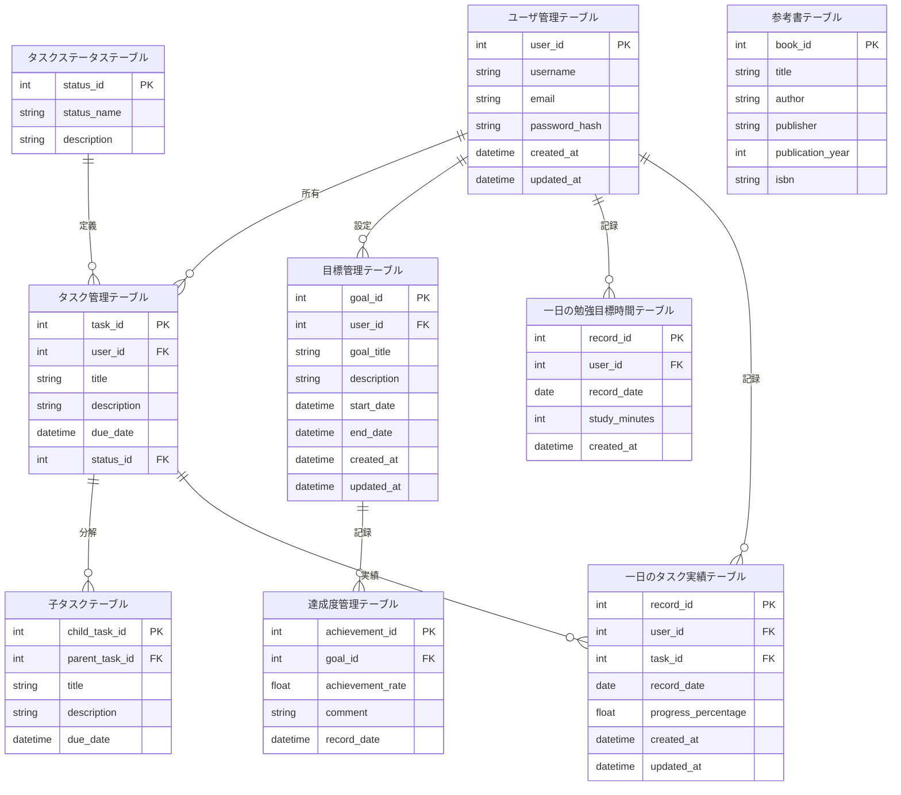

```mermaid
    erDiagram
        %% ユーザ管理テーブル
        ユーザ管理テーブル {
        int user_id PK
        string username
        string email
        string password_hash
        datetime created_at
        datetime updated_at
        }

        %% タスク管理テーブル
        タスク管理テーブル {
        int task_id PK
        int user_id FK
        string title
        string description
        datetime due_date
        int status_id FK
        }

        %% タスクステータステーブル
        タスクステータステーブル {
        int status_id PK
        string status_name
        string description
        }

        %% 子タスクテーブル
        子タスクテーブル {
        int child_task_id PK
        int parent_task_id FK
        string title
        string description
        datetime due_date
        }

        %% 目標管理テーブル
        目標管理テーブル {
        int goal_id PK
        int user_id FK
        string goal_title
        string description
        datetime start_date
        datetime end_date
        datetime created_at
        datetime updated_at
        }

        %% 達成度管理テーブル
        達成度管理テーブル {
        int achievement_id PK
        int goal_id FK
        float achievement_rate
        string comment
        datetime record_date
        }

        %% 一日の勉強目標時間テーブル
        一日の勉強目標時間テーブル {
        int record_id PK
        int user_id FK
        date record_date
        int study_minutes
        datetime created_at
        }

        %% 参考書テーブル
        参考書テーブル {
        int book_id PK
        string title
        string author
        string publisher
        int publication_year
        string isbn
        }

        %% 一日のタスク実績テーブル
        一日のタスク実績テーブル {
        int record_id PK
        int user_id FK
        int task_id FK
        date record_date
        float progress_percentage
        datetime created_at
        datetime updated_at
        }

        %% テーブル間のリレーションシップ

        %% ユーザ管理とタスク管理：ユーザは複数のタスクを所有
        ユーザ管理テーブル ||--o{ タスク管理テーブル : "所有"

        %% タスク管理とタスクステータス：各タスクは1つの状態を持つ
        タスクステータステーブル ||--o{ タスク管理テーブル : "定義"

        %% タスク管理と子タスク：1つのタスクは複数の子タスクに分解される
        タスク管理テーブル ||--o{ 子タスクテーブル : "分解"

        %% ユーザ管理と目標管理：ユーザは複数の目標を持つ
        ユーザ管理テーブル ||--o{ 目標管理テーブル : "設定"

        %% 目標管理と達成度管理：1つの目標に対して複数の進捗記録
        目標管理テーブル ||--o{ 達成度管理テーブル : "記録"

        %% ユーザ管理と一日の勉強目標時間：ユーザは毎日の勉強目標を持つ
        ユーザ管理テーブル ||--o{ 一日の勉強目標時間テーブル : "記録"

        %% ユーザ管理と一日のタスク実績：ユーザはタスク実績を記録
        ユーザ管理テーブル ||--o{ 一日のタスク実績テーブル : "記録"

        %% タスク管理と一日のタスク実績：タスク実績は特定のタスクに紐付く
        タスク管理テーブル ||--o{ 一日のタスク実績テーブル : "実績"
```