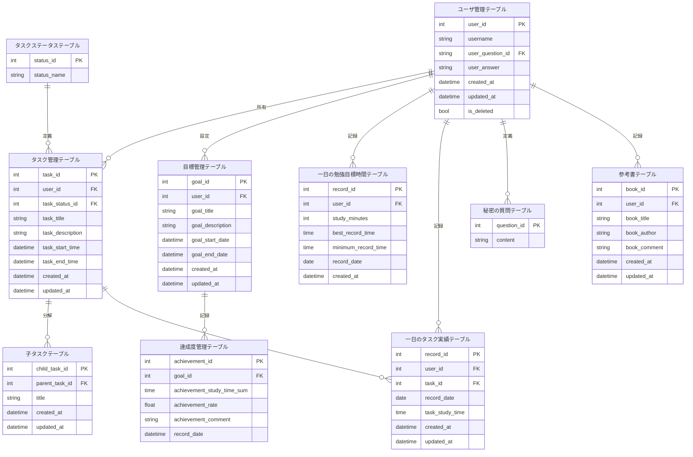

```mermaid
    erDiagram
        %% ユーザ管理テーブル
        ユーザ管理テーブル {
        int user_id PK
        string username
        string user_question_id FK
        string user_answer
        datetime created_at
        datetime updated_at
        bool is_deleted 
        }

        %% 秘密の質問テーブル
        秘密の質問テーブル {
        int question_id PK
        string content
        }

        %% タスク管理テーブル
        タスク管理テーブル {
        int task_id PK
        int user_id FK
        int task_status_id FK
        string task_title
        string task_description
        datetime task_start_time
        datetime task_end_time
        datetime created_at
        datetime updated_at
        }

        %% タスクステータステーブル
        タスクステータステーブル {
        int status_id PK
        string status_name
        }

        %% 子タスクテーブル
        子タスクテーブル {
        int child_task_id PK
        int parent_task_id FK
        string title
        datetime created_at
        datetime updated_at
        }

        %% 目標管理テーブル
        目標管理テーブル {
        int goal_id PK
        int user_id FK
        string goal_title
        string goal_description
        datetime goal_start_date
        datetime goal_end_date
        datetime created_at
        datetime updated_at
        }

        %% 達成度管理テーブル
        達成度管理テーブル {
        int achievement_id PK 
        int goal_id FK
        time achievement_study_time_sum
        float achievement_rate
        string achievement_comment
        datetime record_date
        }

        %% 一日の勉強目標時間テーブル
        一日の勉強目標時間テーブル {
        int record_id PK
        int user_id FK
        int study_minutes
        time best_record_time
        time minimum_record_time
        date record_date
        datetime created_at
        }

        %% 参考書テーブル
        参考書テーブル {
        int book_id PK
        int user_id FK
        string book_title
        string book_author
        string book_comment
        datetime created_at
        datetime updated_at
        }

        %% 一日のタスク実績テーブル
        一日のタスク実績テーブル {
        int record_id PK
        int user_id FK
        int task_id FK
        date record_date
        time task_study_time
        datetime created_at
        datetime updated_at
        }

        %% テーブル間のリレーションシップ

        %% ユーザ管理とタスク管理：ユーザは複数のタスクを所有
        ユーザ管理テーブル ||--o{ タスク管理テーブル : "所有"

        %% タスク管理とタスクステータス：各タスクは1つの状態を持つ
        タスクステータステーブル ||--o{ タスク管理テーブル : "定義"

        %% タスク管理と子タスク：1つのタスクは複数の子タスクに分解される
        タスク管理テーブル ||--o{ 子タスクテーブル : "分解"

        %% ユーザ管理と目標管理：ユーザは複数の目標を持つ
        ユーザ管理テーブル ||--o{ 目標管理テーブル : "設定"

        %% 目標管理と達成度管理：1つの目標に対して複数の進捗記録
        目標管理テーブル ||--o{ 達成度管理テーブル : "記録"

        %% ユーザ管理と一日の勉強目標時間：ユーザは毎日の勉強目標を持つ
        ユーザ管理テーブル ||--o{ 一日の勉強目標時間テーブル : "記録"

        %% ユーザ管理と一日のタスク実績：ユーザはタスク実績を記録
        ユーザ管理テーブル ||--o{ 一日のタスク実績テーブル : "記録"

        %% タスク管理と一日のタスク実績：タスク実績は特定のタスクに紐付く
        タスク管理テーブル ||--o{ 一日のタスク実績テーブル : "実績"

        %% ユーザ管理と秘密の質問テーブル：ユーザは複数の質問から一問定義する
        ユーザ管理テーブル ||--o{ 秘密の質問テーブル : "定義"

        %% ユーザ管理と秘密の質問テーブル：ユーザは読書中の本を管理することができる
        ユーザ管理テーブル ||--o{ 参考書テーブル : "記録"
```