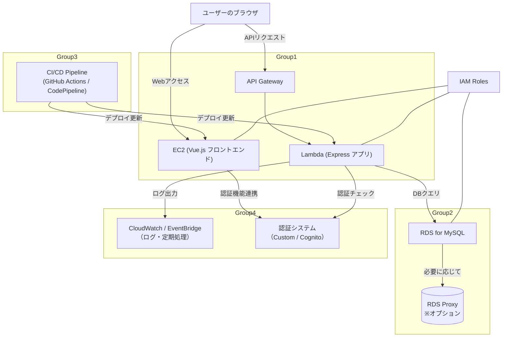

```mermaid
    flowchart TD
        %% ユーザーとフロントエンド
        A[ユーザーのブラウザ]
        
        
        subgraph Group1
            %%フロントエンド
                B["EC2 (Vue.js フロントエンド)"]
            %% バックエンドとAPIゲートウェイ
                C[API Gateway]
                D["Lambda (Express アプリ)"]
        end
        
        subgraph Group2
            %% データベース層
            E[RDS for MySQL]
            F[(RDS Proxy<br>※オプション)]
        end
        H[IAM Roles]

        subgraph Group4
            %% 追加のサービス
            G[CloudWatch / EventBridge<br>（ログ・定期処理）]
            I[認証システム<br>（Custom / Cognito）]
        end
        subgraph Group3
            J["CI/CD Pipeline<br>(GitHub Actions / CodePipeline)"]
        end
        %% フローの定義
        A -->|Webアクセス| B
        A -->|APIリクエスト| C
        C --> D
        D -->|DBクエリ| E
        E -- 必要に応じて --> F
        D -->|ログ出力| G
        B -->|認証機能連携| I
        D -->|認証チェック| I
        J -->|デプロイ更新| B
        J -->|デプロイ更新| D
        H --- B
        H --- D
        H --- E
```